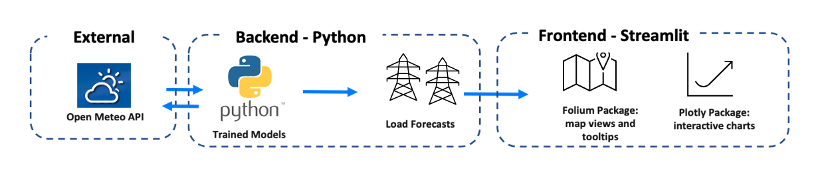

# PJM Day-Ahead Forecasting Tool

## Table of Contents
1. [Streamlit Dashboard](https://qhu75-dva-project-load-streamlit-qhu-vk0cvd.streamlit.app/)
2. [Application Overview](#overview)
3. [Application Architecture](#architecture)
4. [How to Use Application](#usage)
5. [Running Locally](#local)

## Web Application
**Live Application:** [Streamlit Dashboard](https://qhu75-dva-project-load-streamlit-qhu-vk0cvd.streamlit.app/)


<a name="overview"></a>
## Application Overview
PJM is a regional transmission organization (RTO) that manages transmission of electricity for 21 utilities in mid-Atlantic and mid-west states of the US. Each utility in PJM’s territory comprises its own transmission zone. PJM and its member utilities use load forecasts to allocate capacity efficiently, affordably, safely, and reliably. Accurate load forecasting is integral to maintaining a positive reputation with customers, preventing litigation issues, and keeping unexpected/emergency costs down. This visualization tool allows users to interact with the load forecasts. It automatically pulls in weather forecasts to engineer the predictor variables that feed into the final XGBoost models to predict load. The tool is built in Streamlit and utilitizes Folium for mapping and Plotly for interactivity. 

<a name="architecture"></a>
## Application Architecture


<a name="usage"></a>
## How to Use Application
1. Open application - [Streamlit Dashboard](https://qhu75-dva-project-load-streamlit-qhu-vk0cvd.streamlit.app/)
2. Select a date parameter to see predictions for that time - **will default to current date**
3. Select one or more zones to see specific areas - **will default to all zones**
    - Note: you can also click the circle on the map to select a specific zone
4. Select a specific hour to see system load - **will update real time load on graph**
5. Hover over each zone to view peak load and other factors that may contribute to this load


<a name="local"></a>
## Running App Locally (optional)
1. Install dependencies
```
pip install -r requirements.txt
```
2. Run
```
streamlit run load_streamlit.py
```
Now you can view the App locally: <http://localhost:8501/>

